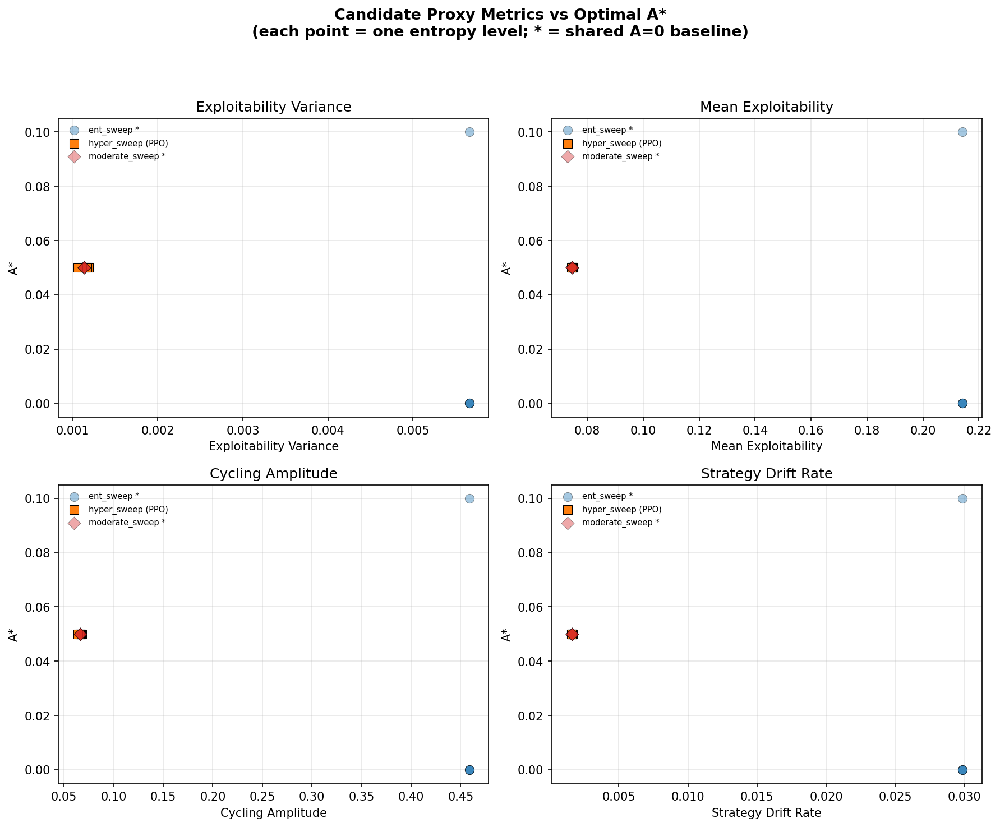

# Forgetting Rate Calibration Study

**Phase 1 of the Expansion Plan: Formalizing the A-Parameter and Predicting A\***

## Motivation

The A-parameter controls the probability of sampling opponents from a historical zoo (A) versus the latest policy (1−A) during adversarial self-play training. Prior A-sweep experiments on RPS established that A\*=0.9 minimizes exploitability for both PPO and Buffered agents — but A\* was found empirically, not predicted.

The expansion plan proposes a theory: A\* is inversely proportional to an agent's *memory capacity* M, which can be quantified by measuring how fast agents forget past strategies. If true, we can predict A\* for new domains without running expensive sweeps, using the formula:

$$A^* = C / H_{\text{forget}}$$

where H_forget is the forgetting half-life (generations until competitiveness halves) and C is a universal coefficient calibrated from data.

This study implements Phase 1: extract the forgetting rate from A=0 self-play in RPS, derive C, and validate the measurement tool.

---

## Methods

### 1. Gauntlet Cross-Evaluation Matrix

The foundation of the analysis is an n×n *gauntlet matrix* built from training checkpoints saved during A=0 self-play.

- **Checkpoint collection**: During self-play training (`train_selfplay.py`), agent parameters are saved at regular intervals (every 10,240 timesteps). This produces ~48 checkpoints spanning the full training run.
- **Pairwise evaluation**: Every checkpoint pair (i, j) is evaluated by instantiating both agents and playing 10,000 rounds of RPS. The resulting win rate W(i,j) = P(agent_i beats agent_j) is recorded.
- **Symmetry**: Since W(j,i) = 1 − W(i,j), only the upper triangle is computed, halving the work.
- **Mode**: The primary mode is `agent_vs_agent` — the same checkpoint series plays both roles. An `agent_vs_opponent` mode (where separate agent/opponent checkpoint series are crossed) is also supported.

The gauntlet matrix captures the full temporal structure of strategy evolution.

### 2. Gap Analysis

The gauntlet matrix is analyzed by *generation gap* Δ — the number of checkpoint intervals separating two agents. For each gap Δ = 1, 2, ..., n−1:

- **Win rates**: All pairs (i, i−Δ) from the lower triangle are collected.
- **Absolute deviation**: mean(|W − 0.5|) measures how far from a draw each matchup lands.
- **Competitiveness**: 1 − 2·mean(|W − 0.5|). A value of 1.0 means all matchups are perfect draws; lower values mean one side dominates.

If forgetting is present, competitiveness should decay monotonically with gap — older opponents become easier to beat because the current agent has "forgotten" how to lose to them.

### 3. Strategy Distance Metrics

Independent of the gauntlet matrix, we extract the action probability vector π(s₀) from each checkpoint (evaluated at the zero observation) and compute two distance metrics per gap Δ:

- **L2 distance**: ‖π_i − π_j‖₂ — Euclidean distance between action probability vectors. Grows as strategies diverge.
- **Cosine similarity**: cos(π_i, π_j) — angular alignment between probability vectors. Decays as strategies diverge.

These provide a direct measure of how much the policy's *output* has changed, complementing the behavioral measure (win rates) from the gauntlet.

### 4. Exponential Decay Fitting

The core hypothesis is that forgetting follows exponential decay:

**Competitiveness model**: C(Δ) = A · exp(−λΔ)

where λ is the forgetting rate and A is the initial competitiveness amplitude. The fit is performed via log-linear regression on the competitiveness-vs-gap curve.

Three metrics are fitted:

| Metric | Model | What it measures |
|---|---|---|
| Competitiveness | A·exp(−λΔ) | Behavioral: how competitive old opponents remain |
| Cosine similarity | A·exp(−λΔ) + baseline | Strategy: angular drift with asymptotic floor |
| L2 growth | 1 − norm(L2) fitted as A·exp(−λΔ) | Strategy: Euclidean divergence (inverted to decay) |

The **best fit** is selected as the metric with the highest R² among those with positive λ (i.e., actual decay, not growth).

### 5. Forgetting Half-Life

From the fitted λ, the forgetting half-life is:

$$H_{\text{forget}} = \ln(2) / \lambda$$

This is the number of generation gaps until competitiveness drops to half its initial value. H_forget = ∞ indicates no forgetting.

### 6. Coefficient C Derivation

Given the known A\* (from completed sweeps) and H_forget (from the decay fit):

$$C = A^* \times H_{\text{forget}}$$

If C is universal across domains, then for a new domain we can measure H_forget from A=0 self-play alone and predict A\* = C / H_forget without running a sweep.

### 7. A\* Extraction from Sweeps

A\* is extracted from existing sweep results (`run_sweep.py` output). For each A value across 10 seeds, the final exploitability (mean of last 10 updates) is computed. A\* is the value that minimizes mean exploitability. The script filters to `seed_*/metrics.jsonl` files only, to avoid contamination from non-sweep results in the same directory.

---

## Experimental Setup

Two configurations were tested, representing opposite ends of the forgetting spectrum:

### Standard Hyperparameters (Primary)

| Parameter | Value |
|---|---|
| Hidden size | 32 |
| Learning rate | 3×10⁻⁴ |
| Entropy coefficient | 0.01 |
| Total timesteps | 500,000 |
| Checkpoint interval | Every 10,240 timesteps |
| Checkpoints | 48 |

These are the default hyperparameters used for the main RPS experiments. The entropy bonus and moderate network size promote smooth strategy cycling.

### Aggressive Hyperparameters (Tool Validation)

| Parameter | Value |
|---|---|
| Hidden size | 4 |
| Learning rate | 3×10⁻⁴ |
| Entropy coefficient | 0.0 |
| Total timesteps | 500,000 |
| Checkpoint interval | Every 10,240 timesteps |
| Checkpoints | 48 |

These deliberately extreme settings (tiny network, no entropy regularization) are known to produce dramatic, non-smooth cycling — expected to show a clear forgetting signal and serve as a positive control for the measurement tool.

---

## Results

### Standard Hyperparameters

**Gauntlet matrix**: 48×48, timesteps 10,240–491,520.

Win rate range: [0.478, 0.522] — extremely narrow. No checkpoint pair deviates more than 2.2% from a draw.

**Exponential decay fits**:

| Metric | λ | R² | H_forget |
|---|---|---|---|
| Competitiveness | −0.000029 | 0.042 | ∞ |
| Cosine similarity | 0.033 | −0.268 | 20.8 gen |
| L2 growth | 0.008 | 0.068 | 86.1 gen |

**Best fit**: L2 growth (R² = 0.068, the only metric with positive λ and positive R²).

**Calibration** (using A\* = 0.9 from sweep):

| Algorithm | A\* | H_forget | C |
|---|---|---|---|
| PPO | 0.9 | 86.1 | 77.5 |
| Buffered | 0.9 | 86.1 | 77.5 |

**Interpretation**: All R² values are below 0.2 — none of the fits capture meaningful structure. The competitiveness fit has *negative* λ (competitiveness slightly *increases* with gap). The derived C = 77.5 is unreliable because H_forget is effectively infinite and the fits are noise.

### Aggressive Hyperparameters

**Gauntlet matrix**: 48×48, timesteps 10,240–491,520.

Win rate range: [0.272, 0.728] — much wider. Checkpoint pairs differ by up to 22.8% from a draw.

**Exponential decay fits**:

| Metric | λ | R² | H_forget |
|---|---|---|---|
| Competitiveness | 0.00403 | **0.737** | 172 gen |
| Cosine similarity | 0.0343 | 0.443 | 20.2 gen |
| L2 growth | 0.0236 | 0.549 | 29.3 gen |

**Best fit**: Competitiveness (R² = 0.737) — a strong exponential decay signal.

**Calibration** (using A\* from sweep):

| Algorithm | A\* | H_forget | C |
|---|---|---|---|
| PPO | 0.05 | 172 | 8.6 |
| Buffered | 0.9 | 172 | 154.7 |

**Interpretation**: The competitiveness-vs-gap curve is well-described by exponential decay (R² = 0.74). However, PPO and Buffered yield wildly different C values (8.6 vs 154.7), indicating that C is **not universal across algorithms** in this configuration. This is expected: the aggressive hyperparams were chosen for tool validation, not for calibrating C. The A\* values themselves are extracted from the standard sweep (which used standard hyperparams), creating a mismatch.

### Comparison

| | Standard | Aggressive |
|---|---|---|
| Win rate range | [0.478, 0.522] | [0.272, 0.728] |
| Best R² | 0.068 | **0.737** |
| λ (best) | 0.008 | 0.004 |
| H_forget | ∞ (unreliable) | 172 gen |
| Forgetting present? | **No** | **Yes** |
| C reliable? | No | Partially (tool works, but C not universal) |

---

## Diagnostic Plots

Each run produces a 6-panel diagnostic figure (`calibration_agent_vs_agent.png`):

1. **Win rate vs gap** — Mean win rate for each generation gap Δ. Flat at 0.5 indicates no gap-dependent advantage.
2. **Competitiveness decay** — Competitiveness vs Δ with exponential fit overlay. A good fit (R² > 0.5) shows decay; flat curves show no forgetting.
3. **Win rate distributions** — Histograms at selected gaps (Δ=1, n/4, n/2, n). Tight distributions around 0.5 indicate no forgetting; spreading tails indicate forgetting.
4. **Strategy drift (L2)** — L2 distance between action probability vectors vs gap, with ±1σ bands.
5. **Strategy autocorrelation (cosine)** — Cosine similarity vs gap with exponential + baseline fit.
6. **A-sweep curve** — Known A\* from completed sweep, showing exploitability vs A for both PPO and Buffered.

---

## Key Findings

### 1. RPS Standard Hyperparams Exhibit No Gap-Dependent Forgetting

The gauntlet matrix shows that competitiveness between checkpoint pairs is essentially constant regardless of how far apart they are in training. The win rate range is [0.478, 0.522] — barely distinguishable from draws. The exponential decay model yields R² < 0.1 for all metrics.

This confirms the earlier qualitative finding: **zoo sampling in RPS solves a cycling problem, not a forgetting problem**. Win rates depend on the *cycling phase* (which of Rock/Paper/Scissors each checkpoint happens to favor), not the *generation gap*.

### 2. The Measurement Tool Works (Validated on Aggressive Hyperparams)

Aggressive hyperparams (hidden=4, no entropy) produce dramatic, jagged cycling that *does* create gap-dependent structure. The competitiveness fit yields R² = 0.74 with λ = 0.004 (H_forget = 172 generations). This confirms:

- The exponential decay model can detect forgetting when it exists.
- The analysis pipeline (gauntlet → gap analysis → exponential fit) is correctly implemented.
- The distinction between "no signal" (standard) and "clear signal" (aggressive) is sharp.

### 3. The Forgetting Prerequisite Is Confirmed

The contrast between standard and aggressive RPS directly validates the forgetting prerequisite identified in the broader A-parameter research:

> Zoo sampling only helps when catastrophic forgetting is present — past adversaries perform better against later protagonists than later adversaries do.

In standard RPS, A\* = 0.9 despite no gap-dependent forgetting, because the zoo breaks cycling — a different mechanism. This means C = A\* × H_forget is not well-defined for RPS standard hyperparams, since H_forget = ∞.

### 4. RPS Is a Negative Control, Not a Calibration Source

Phase 1 of the expansion plan aimed to calibrate C from RPS. The result is that **RPS cannot provide this calibration** because the exponential decay model's assumption (monotonic forgetting as a function of gap) is violated. Instead, RPS serves as a *negative control*: the tool correctly identifies "no forgetting" when it's absent.

The universal coefficient C must be calibrated from a domain with genuine gap-dependent forgetting. The next candidates are:

- **AI-Plays-Tag** (Phase 2): Multi-agent pursuit-evasion with continuous observation spaces — expected to show clear forgetting.
- **Chaos-1B LLM red-teaming** (Phase 3): The target application domain.

---

## Conclusions

1. **The calibration tool is validated**: `calibrate_forgetting.py` correctly distinguishes forgetting (aggressive hyperparams, R²=0.74) from no-forgetting (standard hyperparams, R²<0.1). The pipeline of gauntlet construction → gap analysis → exponential fitting → C derivation is sound.

2. **RPS provides a negative control, not a calibration point**: Standard RPS does not exhibit gap-dependent forgetting. Win rates depend on cycling phase, not generation gap. The exponential decay model correctly identifies this as λ≈0, H_forget=∞.

3. **The forgetting prerequisite is empirically confirmed**: This study provides direct evidence that the mechanism by which zoo sampling helps depends on whether forgetting is present. In RPS, the zoo breaks cycling (phase diversity), not forgetting (temporal retention).

4. **C is not yet calibrated**: The coefficient C = A\* × H_forget requires a domain with both (a) measurable gap-dependent forgetting and (b) a known A\* from sweeps. The next step is Phase 2: apply the same analysis to AI-Plays-Tag.

5. **Three metrics provide complementary views**: Competitiveness (behavioral), L2 distance (strategy drift), and cosine similarity (strategy autocorrelation) each capture different aspects of forgetting. Competitiveness is the most directly relevant to the A-parameter theory and produced the strongest signal in the aggressive case.

---

## Candidate Metrics for Predicting A*

### Motivation

The gauntlet-based calibration above requires training checkpoints and O(n²) pairwise evaluations — expensive for large-scale domains. This section explores whether *cheap proxy metrics*, computable from a single A=0 self-play training log, can predict A* without running a full sweep.

The key idea: each entropy coefficient in the existing `ent_sweep/`, `hyper_sweep/`, and `moderate_sweep/` directories defines a different training configuration. For each, we extract the A* from the full A-sweep and a set of candidate proxy metrics from the A=0 training curve alone.

### Candidate Metrics

All metrics are computed from the A=0 training log (`metrics.jsonl`), averaged across seeds:

| Metric | Formula | Intuition |
|---|---|---|
| **Exploitability variance** | var(agent_exploitability) | Higher variance = more cycling = more instability |
| **Mean exploitability** | mean(agent_exploitability) | Baseline performance without zoo support |
| **Cycling amplitude** | mean(max(p) - min(p)) across actions | How far action probabilities swing over training |
| **Strategy drift rate** | mean(\|Δp\|) between consecutive updates | Velocity of policy change |

### Data Sources

| Sweep | Entropy levels | A=0 baseline | A* variation |
|---|---|---|---|
| `ent_sweep/` | 5 (0.0–0.01) | Shared across ent levels | A* ∈ {0.0, 0.1} |
| `hyper_sweep/` (PPO) | 7 (0.0–0.02) | Independent per ent level | A* = 0.05 (constant) |
| `moderate_sweep/` | 4 (0.0–0.005) | Shared across ent levels | A* = 0.05 (constant) |

**Shared baseline**: In `ent_sweep` and `moderate_sweep`, the A=0 self-play runs are identical across entropy levels (same files reused), so the proxy metrics are constant within each sweep. Only `hyper_sweep` PPO has genuinely independent A=0 training per entropy level, though even there the variation is small.

**Buffered hyper_sweep excluded**: No A=0 data available (buffered runs start at A=0.05).

### Results



Combined correlation (all 16 data points across sweeps):

| Metric | R² | p-value | Slope |
|---|---|---|---|
| Exploitability variance | 0.279 | 0.036 | −6.63 |
| Mean exploitability | 0.279 | 0.035 | −0.22 |
| Cycling amplitude | 0.279 | 0.035 | −0.08 |
| Strategy drift rate | 0.279 | 0.035 | −1.06 |

### Interpretation

1. **All four metrics produce nearly identical R² (≈0.28)**: This is because the metrics are highly correlated with each other — they all measure different aspects of the same underlying cycling behavior. The signal is entirely driven by the between-cluster separation: ent_sweep configurations (high cycling, A*≈0) vs hyper_sweep/moderate configurations (low cycling, A*=0.05).

2. **No within-sweep variation is predictive**: Within `hyper_sweep` (PPO), where A=0 training genuinely varies across entropy levels, A* is constant at 0.05. Within `ent_sweep`, proxy metrics are constant (shared baseline) while A* shows slight variation. Neither direction yields a smooth predictive relationship.

3. **The negative slope is interpretable**: Higher cycling/instability in A=0 self-play is associated with A*≈0, meaning self-play alone is already optimal. This makes sense: the ent_sweep configurations appear to use more aggressive hyperparameters that produce dramatic cycling, where self-play is sufficient for exploration.

4. **R²=0.28 is inflated**: The 16 "data points" are not independent. Nine have shared A=0 baselines (ent_sweep: 5, moderate_sweep: 4), reducing the effective sample size. The signal reflects two hyperparameter regimes, not a smooth dose-response.

### Conclusion

These candidate metrics do not yet provide a reliable proxy for predicting A*. The variation is driven by gross hyperparameter regime differences (aggressive vs standard network size), not by the entropy coefficient sweep that was intended to provide continuous variation. To make this approach work, future experiments would need:

- A=0 training runs that are genuinely independent per entropy level (not shared baselines)
- A wider range of hyperparameter configurations producing diverse A* values
- Validation on domains where A* varies more continuously (e.g., AI-Plays-Tag)

---

## Reproduction

```bash
# Standard hyperparams (negative control)
python calibrate_forgetting.py \
    --ckpt-dir experiments/results/selfplay_standard/checkpoints \
    --hidden 32 --a-star-ppo 0.9 --a-star-buffered 0.9

# Aggressive hyperparams (tool validation)
python calibrate_forgetting.py \
    --ckpt-dir experiments/results/selfplay/checkpoints \
    --hidden 4
```

Results are saved to the parent directory of `--ckpt-dir`:
- `calibration_results.json` — full numerical results
- `calibration_agent_vs_agent.png` — 6-panel diagnostic figure
- Cached gauntlet matrices (`.npy`) for fast re-runs

---

## File Reference

| File | Purpose |
|---|---|
| `calibrate_forgetting.py` | Phase 1 calibration script (this study) |
| `plot_metric_vs_astar.py` | Candidate proxy metric scatter plots |
| `train_selfplay.py` | Generates A=0 self-play checkpoints |
| `run_sweep.py` | A-sweep for empirical A\* |
| `gauntlet.py` | Original cross-evaluation script |
| `zoo.py` | Opponent zoo with A-parameter scheduling |
| `experiments/results/selfplay_standard/` | Standard hyperparams results |
| `experiments/results/selfplay/` | Aggressive hyperparams results |
