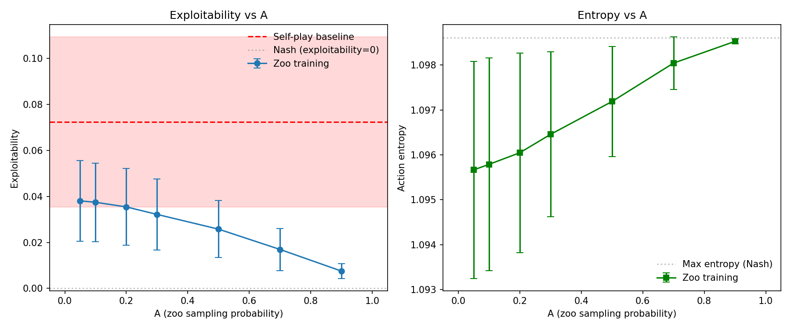
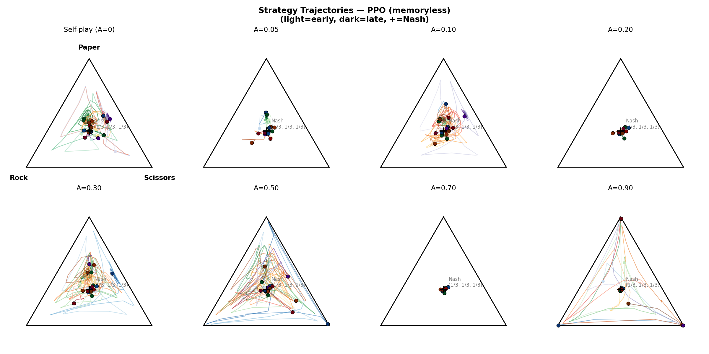
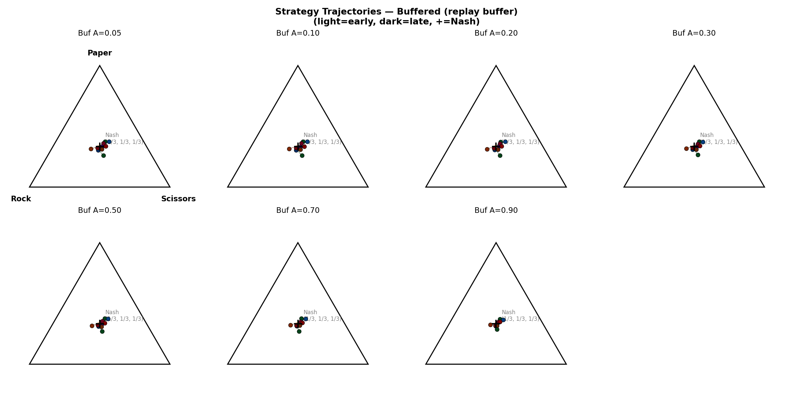
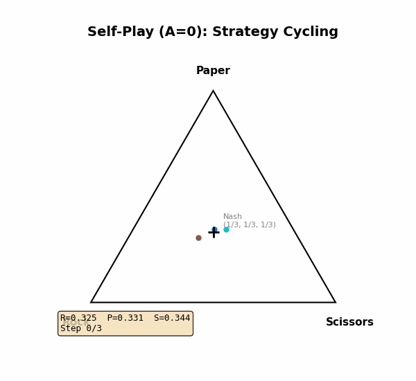
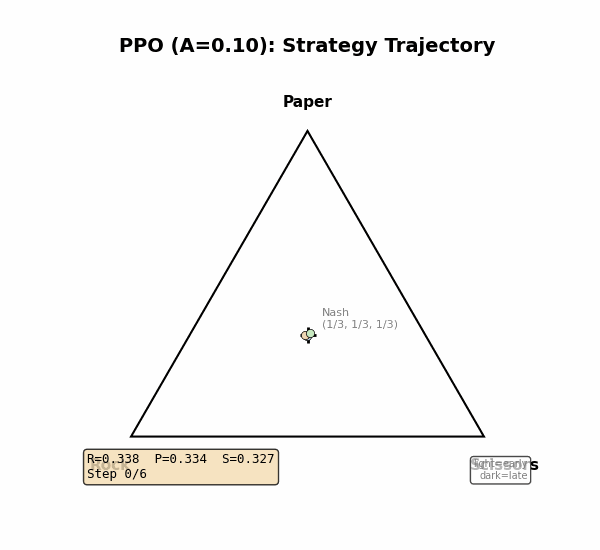
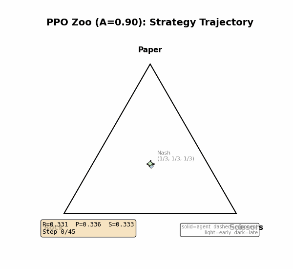
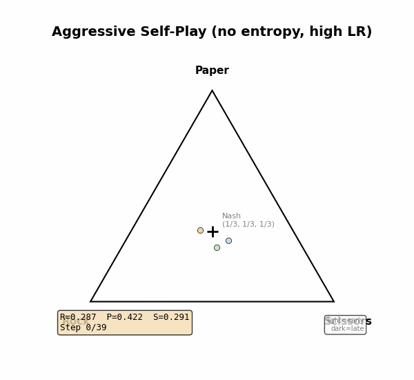
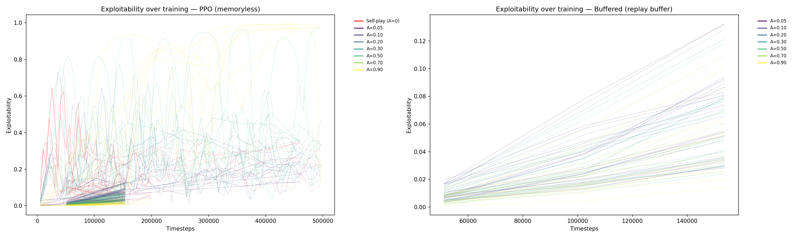

# RPS_RL

Cheap testbed for the A-parameter hypothesis using Rock-Paper-Scissors.

## The A Parameter

A = probability of sampling an opponent from the historical zoo (vs. playing the latest opponent):
- **A=0**: Self-play — always play latest opponent, no zoo. Use `train_selfplay.py`.
- **A in (0, 1)**: Mix of latest opponent + zoo sampling.
- **A near 1**: Almost always sample from zoo (approaches SSP).

A=0 is self-play. A >= 1 is invalid. Arms race is a separate concept (sequential iteration with discarding), not a value of A.

## Hypothesis

A* (optimal zoo sampling ratio for convergence to Nash equilibrium) is inversely proportional to the algorithm's effective memory capacity. PPO (memoryless) should need more zoo sampling (higher A*) than algorithms with replay buffers.

## The Game

Rock-Paper-Scissors is a zero-sum game with a known **Nash equilibrium**: play each action with probability 1/3.

```
Payoff matrix (row player):
         Rock  Paper  Scissors
Rock     [ 0    -1      +1   ]
Paper    [+1     0      -1   ]
Scissors [-1    +1       0   ]
```

Any deviation from (1/3, 1/3, 1/3) can be exploited. This makes RPS ideal for testing convergence: we know exactly what the optimal strategy is.

## Exploitability: How We Measure Convergence

**Exploitability** measures how far a strategy is from Nash equilibrium. It answers: *if an opponent knew my strategy exactly, how much could they win per round?*

Given an agent's mixed strategy (p_R, p_P, p_S), the exploitability is the best-response payoff:

```
exploitability = max(
    p_S - p_P,    # payoff from always playing Rock
    p_R - p_S,    # payoff from always playing Paper
    p_P - p_R     # payoff from always playing Scissors
)
```

**Examples:**

| Strategy | Exploitability | Best response | Meaning |
|----------|---------------|---------------|---------|
| (0.33, 0.33, 0.33) | 0.000 | None (Nash) | Unexploitable |
| (0.50, 0.25, 0.25) | 0.250 | Always Paper | Wins +0.25/round |
| (0.70, 0.15, 0.15) | 0.550 | Always Paper | Wins +0.55/round |
| (1.00, 0.00, 0.00) | 1.000 | Always Paper | Wins every round |

At Nash, exploitability = 0. At a pure strategy, exploitability = 1.

## Example Episodes

What does play actually look like at different exploitability levels?

### Near-Nash agent (exploitability = 0.01)

Agent: R=0.34, P=0.33, S=0.33 — nearly uniform, almost unexploitable.

```
Round   Agent  Opponent  Result  Payoff  Cumulative
-------------------------------------------------------
    1   Paper      Rock       W      +1          +1
    2  Scissors    Rock       L      -1          +0
    3  Scissors   Paper       W      +1          +1
    4   Paper     Paper       D      +0          +1
    5    Rock      Rock       D      +0          +1
```

Even the best response (always Paper) only wins +0.01/round on average. Essentially unbeatable.

### Rock-biased agent (exploitability = 0.55)

Agent: R=0.70, P=0.15, S=0.15 — heavily exploitable. This is what self-play cycling produces: the agent over-commits to one action.

```
Round   Agent  Opponent  Result  Payoff  Cumulative
-------------------------------------------------------
    1    Rock     Paper       L      -1          -1
    2    Rock     Paper       L      -1          -2
    3    Rock     Paper       L      -1          -3
    4  Scissors   Paper       W      +1          -2
    5    Rock     Paper       L      -1          -3
```

An opponent who knows this strategy just plays Paper every time and wins +0.55/round.

### Self-play cycling failure (exploitability = 0.70)

Agent locked into Rock, opponent locked into Paper — both have drifted from Nash. This is the co-evolutionary failure mode: each agent over-adapts to the other's current strategy.

```
Round   Agent  Opponent  Result  Payoff  Cumulative
-------------------------------------------------------
    1    Rock     Paper       L      -1          -1
    2    Rock     Paper       L      -1          -2
    3   Paper      Rock       W      +1          -1
    4    Rock     Paper       L      -1          -2
    5    Rock     Paper       L      -1          -3
```

Both agents are highly exploitable by a third party playing the right counter-strategy, even though they may be "winning" against each other in alternating cycles.

## Results

Full sweep: 150 experiments (7 A values x 10 seeds x 2 algorithms + 10 self-play seeds) at 200k timesteps each.

### PPO vs Buffered: Exploitability vs A



**PPO (memoryless, on-policy):**

| Condition | Exploitability (mean +/- std) | Entropy |
|-----------|-------------------------------|---------|
| Self-play (A=0) | 0.0724 +/- 0.0370 | 1.0905 |
| A=0.05 | 0.0380 +/- 0.0176 | 1.0957 |
| A=0.10 | 0.0374 +/- 0.0171 | 1.0958 |
| A=0.20 | 0.0355 +/- 0.0167 | 1.0960 |
| A=0.30 | 0.0321 +/- 0.0155 | 1.0965 |
| A=0.50 | 0.0258 +/- 0.0125 | 1.0972 |
| A=0.70 | 0.0170 +/- 0.0093 | 1.0980 |
| A=0.90 | 0.0075 +/- 0.0033 | 1.0985 |

**Buffered (replay buffer, off-policy):**

| Condition | Exploitability (mean +/- std) | Entropy |
|-----------|-------------------------------|---------|
| A=0.05 | 0.0380 +/- 0.0178 | 1.0957 |
| A=0.10 | 0.0372 +/- 0.0172 | 1.0957 |
| A=0.20 | 0.0366 +/- 0.0157 | 1.0958 |
| A=0.30 | 0.0338 +/- 0.0155 | 1.0962 |
| A=0.50 | 0.0317 +/- 0.0152 | 1.0964 |
| A=0.70 | 0.0286 +/- 0.0145 | 1.0968 |
| A=0.90 | 0.0236 +/- 0.0121 | 1.0973 |

### Strategy Trajectories on the Simplex

Each point in the triangle represents a mixed strategy over (Rock, Paper, Scissors). The center (+) is Nash equilibrium (1/3, 1/3, 1/3). Colors go from **light (early)** to **dark (late)** iterations. Each color is a different random seed.

**PPO (memoryless):**



**Buffered (replay buffer):**



### Animated Trajectories

**Self-play (A=0)** — strategies wander far from Nash, cycling through Rock → Paper → Scissors:



**PPO Zoo A=0.10** — some wandering, but pulled back toward Nash:



**PPO Zoo A=0.90** — converges tightly to Nash:



### Aggressive Self-Play: Dramatic Cycling

With default hyperparameters, self-play cycling is mild (exploitability 0.03–0.16). By removing the entropy regularizer and increasing the learning rate, the agent over-commits much harder — exploitability peaks above 0.6 and the strategy visibly occupies corners of the simplex before swinging to the next:

```bash
python train_selfplay.py --entropy-coef 0.0 --lr 0.05 --hidden 4 --clip-ratio 100.0 --train-iters 5 --seed 5
```



Without entropy regularization the policy has no incentive to stay mixed, so it collapses toward pure strategies. The high learning rate makes each correction overshoot, creating the classic Rock → Paper → Scissors cycling failure mode.

### Training Dynamics



### Key Findings

1. **Zoo sampling monotonically improves convergence to Nash.** More zoo = lower exploitability. No interior optimum (A*) observed. Both PPO and buffered agents show this pattern.
2. **Self-play cycles.** Without a zoo, PPO agents oscillate through strategies and never converge to Nash (1/3, 1/3, 1/3). Exploitability swings between 0.03 and 0.16.
3. **Even small zoo mixing helps.** A=0.05 (5% zoo) cuts exploitability roughly in half vs self-play.
4. **PPO benefits more from zoo sampling than the buffered agent.** At high A (heavy zoo), PPO reaches exploitability 0.0075 while buffered sits at 0.0236. The curves diverge at higher A — PPO's steep descent vs buffered's flatter curve. This matches the hypothesis prediction that memoryless algorithms are more *sensitive* to zoo sampling.
5. **The buffered agent's flatter curve is consistent with theory.** The replay buffer provides some internal memory, making the agent less dependent on environmental diversity from the zoo. The curve shape is smoother and more gradual, as predicted.
6. **No U-shape.** The hypothesis predicted an optimal interior A* — too much zoo should hurt because historical opponents become stale. In RPS this doesn't happen because the Nash equilibrium is fixed. The zoo never goes stale.

### Implications for the A-Parameter Hypothesis

RPS confirms two of the three predictions:

**Confirmed:**
- Zoo sampling helps memoryless PPO converge (self-play alone cycles)
- PPO (memoryless) has a steeper A curve than the buffered agent — the "two curve shapes" prediction holds. PPO is more sensitive to A.

**Not testable in RPS:**
- Whether there's an optimal interior A* where too much zoo hurts. RPS is too stationary — the Nash equilibrium is fixed, so old zoo checkpoints never become misleading. The U-shape prediction requires a non-stationary environment like Tag or WindGym where opponent strategies genuinely evolve over time.

## Quick Start

```bash
pip install -r requirements.txt

# Self-play baseline (no zoo)
python train_selfplay.py --timesteps 200000

# Aggressive self-play (dramatic cycling — no entropy, high LR)
python train_selfplay.py --timesteps 200000 --entropy-coef 0.0 --lr 0.05 --hidden 4 --clip-ratio 100.0 --train-iters 5

# Single zoo run (PPO)
python train_zoo.py -A 0.1 --timesteps 200000

# Single zoo run (buffered)
python train_zoo_buffered.py -A 0.1 --timesteps 200000

# Full A sweep — both algorithms (150 experiments, ~minutes on CPU)
python run_sweep.py --timesteps 200000

# Analyze results
python analyze.py experiments/results/

# Generate simplex animations and visualizations
python visualize.py experiments/results/
```
