# RPS_RL

Cheap testbed for the A-parameter hypothesis using Rock-Paper-Scissors.

## The A Parameter

A = probability of sampling an opponent from the historical zoo (vs. playing the latest opponent):
- **A=0**: Self-play — always play latest opponent, no zoo. Use `train_selfplay.py`.
- **A in (0, 1)**: Mix of latest opponent + zoo sampling.
- **A near 1**: Almost always sample from zoo (approaches SSP).

A=0 is self-play. A >= 1 is invalid. Arms race is a separate concept (sequential iteration with discarding), not a value of A.

## Hypothesis

A* (optimal zoo sampling ratio for convergence to Nash equilibrium) is inversely proportional to the algorithm's effective memory capacity. PPO (memoryless) should need more zoo sampling (higher A*) than algorithms with replay buffers.

## The Game

Rock-Paper-Scissors is a zero-sum game with a known **Nash equilibrium**: play each action with probability 1/3.

```
Payoff matrix (row player):
         Rock  Paper  Scissors
Rock     [ 0    -1      +1   ]
Paper    [+1     0      -1   ]
Scissors [-1    +1       0   ]
```

Any deviation from (1/3, 1/3, 1/3) can be exploited. **Exploitability** measures how far a strategy is from Nash — it's the best-response payoff an omniscient opponent could achieve:

```
exploitability = max(p_S - p_P, p_R - p_S, p_P - p_R)
```

At Nash, exploitability = 0. At a pure strategy, exploitability = 1.

## Results

We ran three experiment sets: a standard sweep (150 experiments, 200k timesteps, 10 seeds), an aggressive hyperparameter sweep, and an entropy/hyperparameter sweep (252 experiments, 500k timesteps, 3 seeds).

### The Problem: Self-Play Cycles

Without a zoo, PPO agents oscillate through strategies and never converge to Nash. Each agent over-adapts to the other's current strategy, creating Rock → Paper → Scissors cycling.

**Self-play (A=0)** — strategies wander far from Nash:


Each point in the simplex represents a mixed strategy over (Rock, Paper, Scissors). The center (+) is Nash equilibrium (1/3, 1/3, 1/3). Solid lines/circles are the agent; dashed lines/diamonds are the opponent. Colors go from light (early) to dark (late).

With aggressive hyperparameters (no entropy regularization, high learning rate, small network, no PPO clipping), the cycling becomes dramatic:

```bash
python train_selfplay.py --entropy-coef 0.0 --lr 0.05 --hidden 4 --clip-ratio 100.0 --train-iters 5 --seed 5 --timesteps 500000
```

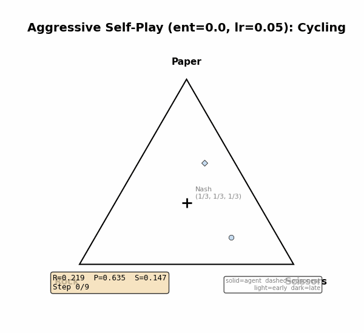

### The Solution: Zoo Sampling

Zoo sampling mixes in historical opponents, preventing the co-evolutionary spiral. At 200k timesteps with standard hyperparameters, more zoo = lower exploitability:


**PPO (memoryless, on-policy) — 200k timesteps, 10 seeds:**

| Condition | Exploitability (mean +/- std) | Entropy |
|-----------|-------------------------------|---------|
| Self-play (A=0) | 0.0724 +/- 0.0370 | 1.0905 |
| A=0.05 | 0.0380 +/- 0.0176 | 1.0957 |
| A=0.10 | 0.0374 +/- 0.0171 | 1.0958 |
| A=0.20 | 0.0355 +/- 0.0167 | 1.0960 |
| A=0.30 | 0.0321 +/- 0.0155 | 1.0965 |
| A=0.50 | 0.0258 +/- 0.0125 | 1.0972 |
| A=0.70 | 0.0170 +/- 0.0093 | 1.0980 |
| A=0.90 | 0.0075 +/- 0.0033 | 1.0985 |

**Buffered (replay buffer, off-policy) — 200k timesteps, 10 seeds:**

| Condition | Exploitability (mean +/- std) | Entropy |
|-----------|-------------------------------|---------|
| A=0.05 | 0.0380 +/- 0.0178 | 1.0957 |
| A=0.10 | 0.0372 +/- 0.0172 | 1.0957 |
| A=0.20 | 0.0366 +/- 0.0157 | 1.0958 |
| A=0.30 | 0.0338 +/- 0.0155 | 1.0962 |
| A=0.50 | 0.0317 +/- 0.0152 | 1.0964 |
| A=0.70 | 0.0286 +/- 0.0145 | 1.0968 |
| A=0.90 | 0.0236 +/- 0.0121 | 1.0973 |

PPO's A curve drops more steeply than Buffered's — PPO reaches 0.0075 at A=0.9 while Buffered sits at 0.0236. This matches the hypothesis that memoryless algorithms are more sensitive to zoo sampling.

**PPO Zoo A=0.10** — some wandering, but pulled back toward Nash:


**PPO Zoo A=0.90** — converges tightly to Nash:


**Simplex comparisons** across all A values and seeds:


### But Heavy Zoo Degrades Over Time

The 200k results tell an incomplete story. At 500k timesteps, the A curve **inverts** — agents trained with heavy zoo sampling have degraded significantly:

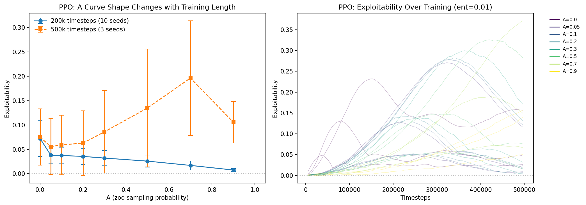

| A | Exploitability at 200k | Exploitability at 500k |
|---|----------------------|----------------------|
| 0.0 (self-play) | 0.0724 | 0.0753 |
| 0.05 | 0.0380 | 0.0556 |
| 0.10 | 0.0374 | 0.0590 |
| 0.50 | 0.0258 | 0.1349 |
| 0.90 | 0.0075 | 0.1054 |

A=0.9 produces the lowest exploitability at 200k (0.0075) but rises 14x to 0.105 by 500k. Meanwhile, A=0.05 slowly improves from 0.038 to 0.056.

**Interpretation:** Heavy zoo sampling accelerates early convergence by providing diverse opponents. But after the agent nears Nash, the continued diversity becomes destabilizing — the agent chases each zoo opponent's particular weakness, slowly pulling away from the uniform equilibrium. Light zoo sampling (A=0.05) is slower but more stable long-term. This suggests A should be **annealed during training** — high early, low late.

### Aggressive Hyperparameters Invert the A Curve

With aggressive hyperparameters (ent=0.0, lr=0.05, hidden=4, clip=100), the A curve inverts completely — more zoo = worse, even at short timescales:

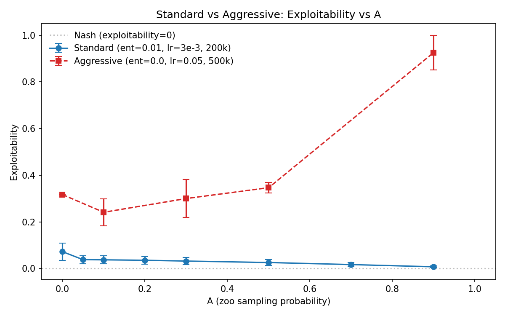

| Condition | Exploitability (aggressive) | Exploitability (standard) |
|-----------|----------------------------|--------------------------|
| Self-play (A=0) | 0.3170 | 0.0724 +/- 0.0370 |
| A=0.05 | 0.2081 +/- 0.0626 | 0.0380 +/- 0.0176 |
| A=0.1 | 0.2412 +/- 0.0575 | 0.0374 +/- 0.0171 |
| A=0.3 | 0.3002 +/- 0.0817 | 0.0321 +/- 0.0155 |
| A=0.5 | 0.3467 +/- 0.0226 | 0.0258 +/- 0.0125 |
| A=0.9 | 0.9258 +/- 0.0744 | 0.0075 +/- 0.0033 |

The agent over-fits to beating specific zoo members instead of generalizing toward Nash. The zoo's diversity becomes a liability — each historical opponent pulls the agent toward a different counter-strategy, and the agent collapses to whichever pure strategy beats the most recent zoo sample.

**Aggressive A=0 (self-play)** — dramatic cycling between pure strategies:


**Aggressive A=0.05** — slight improvement over self-play, but still noisy:

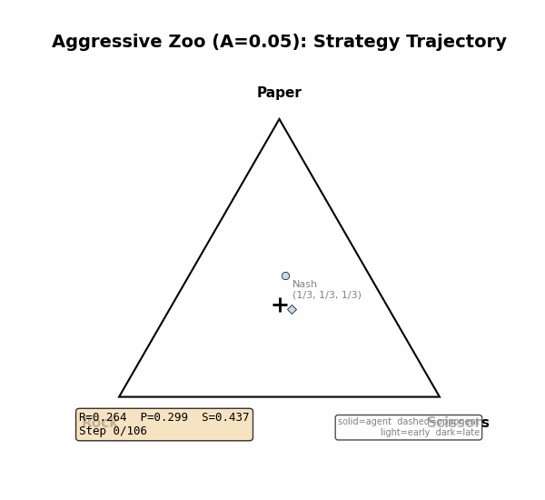

**Aggressive A=0.1** — mild zoo, cycling with moderate amplitude:

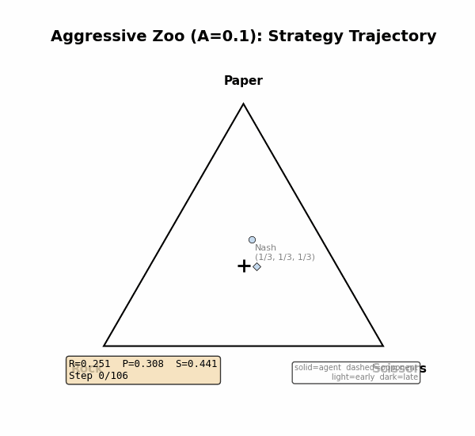

**Aggressive A=0.3** — more zoo pulls the agent further off Nash:

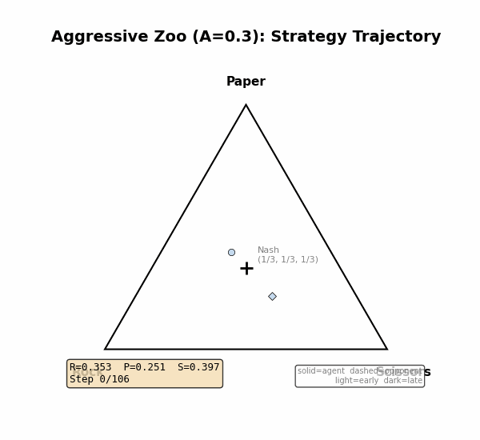

**Aggressive A=0.5** — agent drifts toward corners, large exploitability:

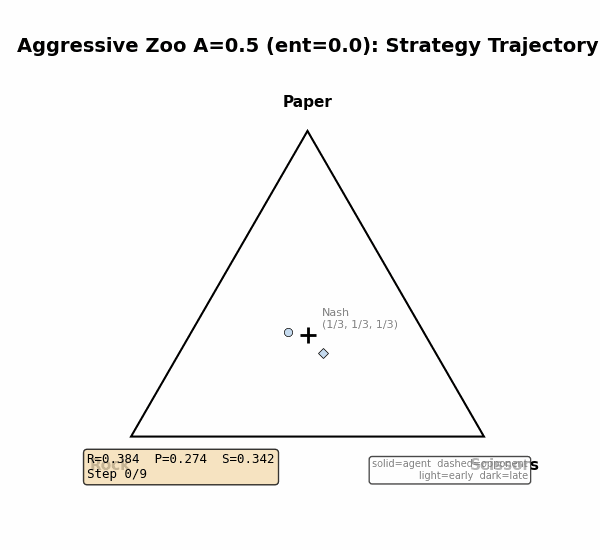

**Aggressive A=0.9** — near-pure zoo sampling, agent collapses to a corner:

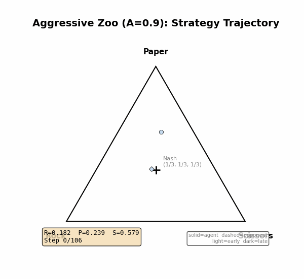

### Entropy Regularization Doesn't Shift A*

We swept 7 entropy levels (0.0 to 0.02) across 8 A values for PPO and 4 entropy levels across 7 A values for Buffered, all at 500k timesteps. Result: **A*=0.05 for all entropy levels tested, for both algorithms.**

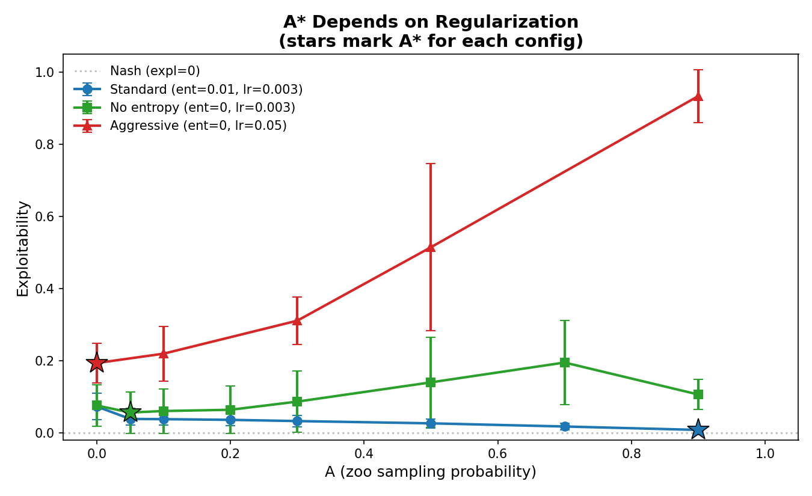

Entropy regularization slightly reduces overall exploitability (all curves shift down with higher entropy) but does not change the optimal zoo sampling ratio. The A curve shape — minimum at A=0.05, rising through A=0.5–0.7, then partially recovering at A=0.9 — is consistent across all conditions.

### Training Dynamics


### A-Parameter Scheduling

Since A* is dynamic — high A accelerates early convergence but degrades later — we tested whether **scheduling A to ramp up over training** could combine early self-play stability with late zoo diversity. Three schedule shapes were tested, all parameterized by a halflife `h` (fraction of training where A reaches 0.5):

- **Exponential**: `A(t) = 1 - exp(-ln2 * t/(hT))` — fast initial ramp, slow asymptote
- **Linear**: `A(t) = min(t/(2hT), 1)` — constant rate
- **Sigmoid**: `A(t) = 1/(1 + exp(-k(t/T - h)))` — S-curve

We ran 360 experiments: 3 schedules x 3 halflife values (0.10, 0.25, 0.50) x 2 sampling strategies (uniform, Thompson) x 10 seeds, at both 200k and 500k timesteps.

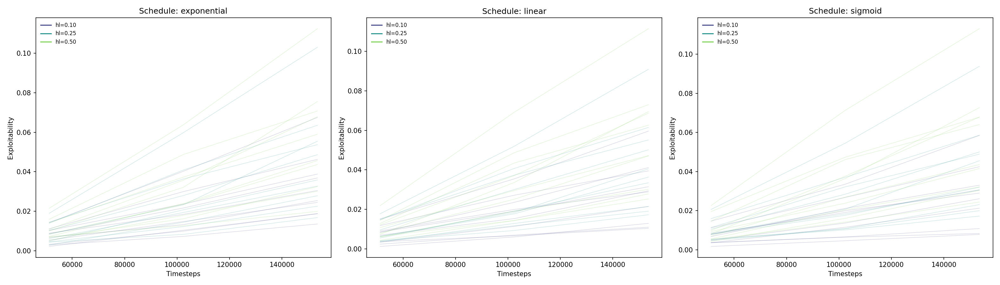

**200k timesteps — Uniform sampling (10 seeds):**

| Condition | Exploitability |
|-----------|---------------|
| Constant A=0.90 (best constant) | 0.0075 +/- 0.0033 |
| Sigmoid hl=0.10 (best schedule) | 0.0166 +/- 0.0092 |
| Linear hl=0.10 | 0.0176 +/- 0.0093 |
| Exponential hl=0.10 | 0.0195 +/- 0.0095 |
| Constant A=0.50 | 0.0258 +/- 0.0125 |

**200k timesteps — Thompson sampling (10 seeds):**

| Condition | Exploitability |
|-----------|---------------|
| Constant A=0.90 (best constant) | 0.0053 +/- 0.0014 |
| Linear hl=0.10 (best schedule) | 0.0087 +/- 0.0042 |
| Sigmoid hl=0.10 | 0.0089 +/- 0.0050 |
| Exponential hl=0.10 | 0.0109 +/- 0.0063 |

At 200k, schedules **underperform** the best constant A. The best schedule (Thompson linear hl=0.10, exploitability 0.0087) is 64% worse than constant Thompson A=0.90 (0.0053). Ramping up means the agent spends early training at low A, missing the convergence-accelerating effect of early zoo diversity.

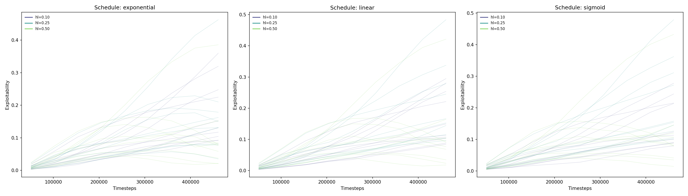

**500k timesteps — Uniform sampling (10 seeds):**

| Condition | Exploitability |
|-----------|---------------|
| Constant A=0.05 (best constant) | 0.0556 +/- ? |
| Exponential hl=0.50 | 0.0796 +/- 0.0497 |
| Sigmoid hl=0.10 | 0.0798 +/- 0.0349 |
| Linear hl=0.50 | 0.0829 +/- 0.0523 |
| Constant A=0.90 (worst constant) | 0.1054 +/- ? |

**500k timesteps — Thompson sampling (10 seeds):**

| Condition | Exploitability |
|-----------|---------------|
| Linear hl=0.10 (best schedule) | 0.0536 +/- 0.0213 |
| Sigmoid hl=0.10 | 0.0585 +/- 0.0231 |
| Exponential hl=0.10 | 0.0644 +/- 0.0272 |

At 500k, schedules **also degrade**, landing between the best constant (A=0.05 at 0.0556) and the worst constant (A=0.90 at 0.1054). The best schedule (Thompson linear hl=0.10 at 0.0536) is comparable to constant A=0.05 — no significant improvement.

**Why scheduling up doesn't help:** The upward ramp gives the worst of both worlds. Early training uses low A (missing the convergence boost from zoo diversity), while late training uses high A (causing the documented zoo-diversity destabilization). The data suggests the opposite schedule — **decreasing A** (high early, low late) — would better match the observed dynamics, since high A accelerates early convergence and low A prevents late degradation. However, a decreasing schedule is functionally equivalent to simply training with high constant A for fewer timesteps, which the existing results already demonstrate works well.

**Thompson Sampling remains beneficial at all schedule settings**, reducing exploitability by ~40–50% for hl=0.10 schedules. This is consistent with the constant-A Thompson results: adaptive opponent selection helps whenever the agent samples frequently from the zoo.

```bash
# Run with exponential schedule
python train_zoo.py --a-schedule exponential --a-halflife 0.25 --timesteps 200000

# Run with Thompson + linear schedule
python train_zoo.py --a-schedule linear --a-halflife 0.10 --sampling-strategy thompson --timesteps 500000

# Full schedule sweep
python run_sweep.py --a-schedule exponential --timesteps 200000 --sampling-strategy thompson
```

## Key Findings

1. **Zoo sampling helps — in the right amount.** A small amount of zoo sampling (A=0.05) consistently reduces exploitability vs self-play. At 200k timesteps, heavier zoo sampling helps more; at 500k, only light zoo remains beneficial.
2. **A* depends on training length, not entropy.** At 200k, A*=0.9. At 500k, A*=0.05. The entropy coefficient (0.0–0.02) does not shift A*. This suggests the zoo's benefit is about convergence speed, not a fixed equilibrium property.
3. **Heavy zoo sampling degrades over time.** A=0.9 produces the lowest exploitability at 200k (0.0075) but rises 14x by 500k (0.105). The continued diversity of zoo opponents destabilizes the agent after initial convergence.
4. **PPO benefits more from zoo sampling than the buffered agent.** PPO's A curve drops more steeply than Buffered's, matching the hypothesis that memoryless algorithms are more sensitive to zoo sampling.
5. **Aggressive hyperparameters invert the A curve.** With high LR, small network, and no clipping, more zoo = worse performance. The agent needs enough capacity and stability to generalize from diverse opponents.
6. **Thompson Sampling improves high-A performance.** Adaptive opponent selection via Thompson Sampling cuts exploitability by 30–69% at A=0.70–0.90, with negligible effect at low A. The benefit scales with how often the agent samples from the zoo — when most training comes from zoo opponents, picking *which* opponent matters.
7. **Scheduling A upward doesn't beat constant A.** Ramping A from 0 to 1 over training (360 experiments, 3 schedule shapes, 3 halflife values) underperforms the best constant A at both 200k and 500k timesteps. The upward ramp misses early convergence benefits and still accumulates late destabilization. The degradation from zoo diversity appears to be a function of cumulative exposure, not just instantaneous A level.

## Implications for the A-Parameter Hypothesis

**Confirmed:**
- Zoo sampling helps memoryless PPO converge (self-play alone cycles)
- PPO (memoryless) has a steeper A curve than the buffered agent — the "two curve shapes" prediction holds
- Interior A* exists — too much zoo hurts, even with proper regularization (at 500k)

**New insights from RPS:**
- **A* is dynamic, not static.** The optimal zoo ratio changes over training. Early on, heavy zoo accelerates convergence. Later, it destabilizes.
- **Scheduling A upward doesn't help.** Ramping A from 0 to 1 over training (exponential, linear, sigmoid schedules) underperforms constant A at both 200k and 500k. The upward ramp misses early convergence benefits and still accumulates late degradation. A *decreasing* schedule (high early, low late) would match the dynamics better, but is functionally equivalent to simply training with high constant A for fewer timesteps. The degradation from zoo diversity is a function of cumulative exposure, not just the instantaneous A level.
- **Entropy regularization doesn't shift A*.** Within the range tested (0.0–0.02), all entropy levels produce the same A*=0.05 at 500k. Entropy reduces overall exploitability but doesn't change the optimal zoo ratio.
- **Aggressive hyperparameters break the zoo.** When the learning rate is too high or the network too small, zoo diversity becomes harmful at any level. The agent needs enough capacity and stability to generalize from diverse opponents.
- **Thompson Sampling scales with A.** Adaptive opponent selection has negligible effect at low A but cuts exploitability by up to 69% at high A. The Buffered algorithm benefits more than PPO from Thompson at high A, suggesting the replay buffer amplifies opponent quality.

**Not testable in RPS:**
- Whether the zoo *staleness* mechanism produces a U-shape. RPS Nash is fixed, so old checkpoints never become misleading. The degradation at high A we observe comes from over-diversity, not staleness. Testing the staleness mechanism requires a non-stationary environment like Tag or WindGym.

## Thompson Sampling for Zoo Opponent Selection

Instead of uniform random sampling from the zoo, **Thompson Sampling** adaptively selects opponents that produce competitive (informative) matches. Each zoo checkpoint maintains a Beta(alpha, beta) posterior:

- **Reward signal:** Match competitiveness. `|mean_reward| < threshold` = success (close game), else failure.
- **Selection:** Sample theta_i ~ Beta(alpha_i, beta_i) for each checkpoint, pick argmax.
- **Default threshold:** 0.3 (exposed as `--competitiveness-threshold`).
- New checkpoints start with Beta(1, 1) (uninformative prior).

**Hypothesis:** Thompson Sampling may help with the documented degradation at high A values (A=0.9 exploitability rises 14x from 200k to 500k) by avoiding stale opponents the agent has already learned to beat.

### Results

Thompson Sampling improves exploitability at all A values, with the effect **scaling dramatically with A**:


**PPO — Uniform vs Thompson (200k timesteps, 10 seeds):**

| A | Uniform | Thompson | Improvement |
|---|---------|----------|-------------|
| 0.05 | 0.0380 +/- 0.0176 | 0.0373 +/- 0.0175 | ~2% |
| 0.10 | 0.0374 +/- 0.0171 | 0.0366 +/- 0.0167 | ~2% |
| 0.20 | 0.0355 +/- 0.0167 | 0.0322 +/- 0.0151 | ~9% |
| 0.30 | 0.0321 +/- 0.0155 | 0.0287 +/- 0.0132 | ~11% |
| 0.50 | 0.0258 +/- 0.0125 | 0.0207 +/- 0.0096 | ~20% |
| 0.70 | 0.0170 +/- 0.0093 | 0.0108 +/- 0.0046 | ~36% |
| 0.90 | 0.0075 +/- 0.0033 | 0.0053 +/- 0.0014 | ~29% |

**Buffered — Uniform vs Thompson (200k timesteps, 10 seeds):**

| A | Uniform | Thompson | Improvement |
|---|---------|----------|-------------|
| 0.05 | 0.0380 +/- 0.0178 | 0.0368 +/- 0.0178 | ~3% |
| 0.10 | 0.0372 +/- 0.0172 | 0.0360 +/- 0.0160 | ~3% |
| 0.20 | 0.0366 +/- 0.0157 | 0.0334 +/- 0.0154 | ~9% |
| 0.30 | 0.0338 +/- 0.0155 | 0.0294 +/- 0.0152 | ~13% |
| 0.50 | 0.0317 +/- 0.0152 | 0.0234 +/- 0.0120 | ~26% |
| 0.70 | 0.0286 +/- 0.0145 | 0.0151 +/- 0.0070 | ~47% |
| 0.90 | 0.0236 +/- 0.0121 | 0.0073 +/- 0.0039 | ~69% |

**Interpretation:** At low A (0.05), the agent rarely samples from the zoo, so *which* opponent it picks barely matters — Thompson and uniform perform nearly identically. At high A (0.70–0.90), the agent samples from the zoo most of the time, and Thompson's adaptive selection cuts exploitability by 30–69%. Thompson preferentially selects opponents that produce competitive matches, avoiding stale opponents the agent has already learned to beat.

The Buffered algorithm benefits even more from Thompson than PPO does at high A (69% vs 29% improvement at A=0.90), suggesting that the replay buffer amplifies the value of opponent quality — good opponents produce better training data that persists across multiple updates.

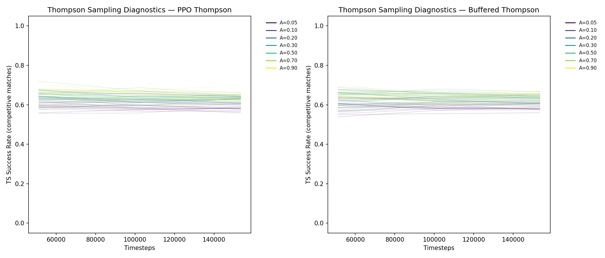

```bash
# Single Thompson run (PPO)
python train_zoo.py -A 0.1 --sampling-strategy thompson --timesteps 200000

# Single Thompson run (buffered)
python train_zoo_buffered.py -A 0.1 --sampling-strategy thompson --timesteps 200000

# Full sweep — both uniform and Thompson
python run_sweep.py --sampling-strategy both --timesteps 200000

# Analyze results (generates thompson_comparison.png and ts_diagnostics.png)
python analyze.py experiments/results/
```

## Quick Start

```bash
pip install -r requirements.txt

# Self-play baseline (no zoo)
python train_selfplay.py --timesteps 200000

# Aggressive self-play (dramatic cycling — no entropy, high LR)
python train_selfplay.py --timesteps 500000 --entropy-coef 0.0 --lr 0.05 --hidden 4 --clip-ratio 100.0 --train-iters 5

# Single zoo run (PPO)
python train_zoo.py -A 0.1 --timesteps 200000

# Single zoo run (buffered)
python train_zoo_buffered.py -A 0.1 --timesteps 200000

# Full A sweep — both algorithms (150 experiments, ~minutes on CPU)
python run_sweep.py --timesteps 200000

# Analyze results
python analyze.py experiments/results/

# Generate simplex animations and visualizations
python visualize.py experiments/results/
```
